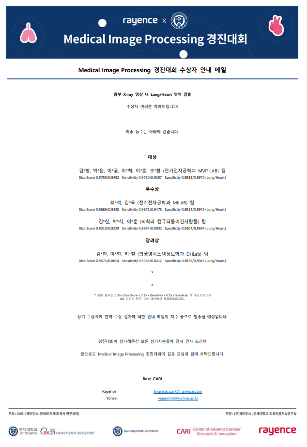

# Cardiac and Lung multiple segmentation
3rd Award in competion in Rayence Co.
Collaborated with Jung hoon Lee. JunSik Park.




## Requirements
- pydicom 2.3
- opencv-python
- tensorflow 2.x
```
$ conda create -n [env_name] python==3.8
$ conda activate [env_name]
$ python3 -m pip install -r requirements.txt
```

## Directory
```
├─data
│  ├─JSRT
│  │  ├─nodules
│  │  │  ├─dicom
│  │  │  └─png
│  │  ├─non_nodules
│  │  │  ├─dicom
│  │  │  └─png
│  │  └─scr
│  │      ├─landmarks
│  │      ├─masks
│  │      │  ├─heart
│  │      │  ├─heart_resized
│  │      │  ├─left clavicle
│  │      │  ├─left lung
│  │      │  ├─right clavicle
│  │      │  └─right lung
│  │      └─points
│  ├─test
│  │  ├─img
│  │  └─mask
│  └─train
│      ├─img
│      └─mask
├─augmentation.py 
├─block.py
├─data_prep.
├─main.ipnby
└─build_model.py

```

## How to use?
```
// python3 inference.py -i [image_path] -m [model_path] -o [output_image_path]
python inference.py -m data/params/params.hdf5 -o output_image.png -i test_data/0151.jpg
```

## Image spec
- 2D gray scale
- normalized with [0, 255]
- [512, 512]


## Lisence
The copyright and rights of the program have been transferred to Co., Ltd. A.
